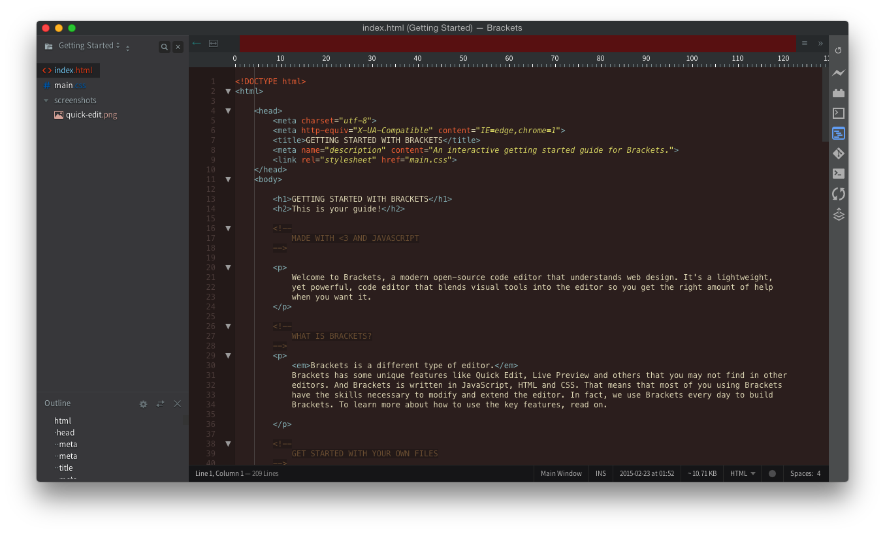

Birds of Paradise Theme for Brackets
===

Birds of Paradise theme  [Coda](https://panic.com/coda//), ported to Brackets.
Original Birds of Paradise theme, [here](https://github.com/jbergantine/Birds-of-Paradise).
I also have this theme available in Sublime Text

Screenshots
---

### HTML
##

### CSS
##

### JavaScript
##

Installation
---

This extension requires Brackets Release 1.0 or newer.

1. Open Brackets
2. Open the Extension Manager
3. Switch to "Themes" tab
4. Search for "BirdsofParadise-Brackets"
5. Click "Install"

Known Issues
---
Some syntax highlighting may be off compared to the original Birds of Paradise theme. This is most likely
a result of the way Brackets handles themes.
If you find a mismatch, please feel free to open an issue or pull request. I'll do my best to get
it fixed up quickly.

License
---

The MIT License. Read [LICENSE](LICENSE) for further information.